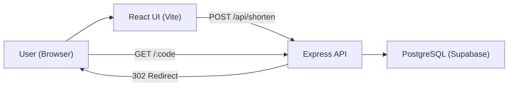

# Link Shortner

A clean, minimal link shortener built with React, Express, PostgreSQL (Supabase), and Prisma. Generate short URLs with optional expiry and fast redirects.

## Frontend

### Setup Guide

1. Install dependencies:
   - `cd client && npm install`
2. (Optional) Configure API base:
   - Create `client/.env`
   - Set `VITE_API_BASE=http://localhost:4000/api`
3. Start the app:
   - `npm run dev`

### Features

- Clean UI for creating short links
- Optional expiry (in days) with toggle
- Displays the generated short URL

## Server

### Setup Guide

1. Create a Postgres database (Supabase recommended).
2. Copy `server/.env.example` to `server/.env` and set:
   - `DATABASE_URL="postgresql://..."`
   - `APP_BASE_URL="http://localhost:4000"`
3. Install dependencies:
   - `cd server && npm install`
4. Run Prisma migration:
   - `npx prisma migrate dev --name init`
5. Start the API:
   - `npm run dev`

### Features

- `POST /api/shorten` to create short URLs
  - Body: `{ longUrl, expiresInDays }` (`expiresInDays` can be `null` for permanent)
- `GET /:code` redirects to the original URL
- Expired links return 410
- `shortCode` is unique and indexed by the database

### How It Works

1. Client submits a long URL + optional expiry days.
2. Server validates input and generates a short code.
3. Record is saved to Postgres via Prisma.
4. Visiting `/:code` looks up the long URL and redirects (or returns 404/410).

### Collision Handling

`shortCode` is generated with `nanoid`. If a collision happens (unique constraint error), the server retries up to 5 times before failing.

## App Flow

